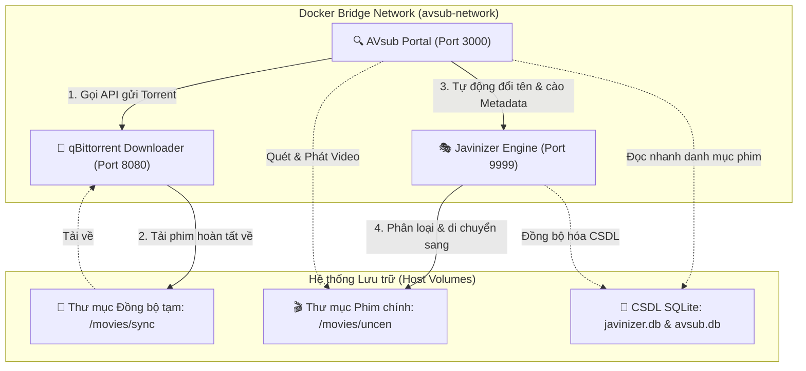

# 🐳 AVsub - Hệ thống Tự động hóa Tìm kiếm Phụ đề & Cào Metadata JAV

AVsub là một cổng thông tin tự động hóa mạnh mẽ, hiện đại, giúp bạn tìm kiếm phụ đề trên `avsubtitles.com` và đồng bộ hóa với hệ thống quản lý phim JAV. 

Dự án được tối ưu hóa để chạy **hoàn toàn độc lập** hoặc **kết hợp mượt mà** với các dịch vụ quản lý JAV phổ biến như **Javinizer Go** và trình tải **qBittorrent** thông qua Docker chỉ với **một câu lệnh duy nhất**.

---

## 📐 Sơ đồ Kiến trúc Hệ thống (Docker Stack)

Dưới đây là mô hình hoạt động khép kín của toàn bộ hệ thống khi được triển khai thông qua Docker Compose:



---

## 🚀 Hướng dẫn Cài đặt nhanh trong 1 bước (Docker Compose)

### 1. Chuẩn bị thư mục trên hệ điều hành của bạn (Host)
Hãy tạo trước các thư mục để chứa phim và lưu cơ sở dữ liệu trên máy chủ của bạn:
```bash
# Tạo các thư mục lưu phim và CSDL
mkdir -p /srv/nas_share/Arr/uncen
mkdir -p /srv/nas_share/Arr/sync
mkdir -p /srv/nas_share/Database/avsub
mkdir -p /srv/nas_share/Database/javinizer
```

### 2. Thiết lập Biến Môi trường (`.env`)
Sao chép tệp cấu hình mẫu `.env.example` thành `.env` và cập nhật các đường dẫn thực tế của bạn:
```bash
cp .env.example .env
```
Mở tệp `.env` vừa tạo và điền các đường dẫn tương ứng (như `/srv/nas_share/...` đã tạo ở bước 1).

### 3. Khởi động toàn bộ Stack hệ thống
Bật toàn bộ 3 dịch vụ **AVsub**, **Javinizer** và **qBittorrent** lên bằng Docker Compose:
```bash
docker compose up -d
```
Hệ thống sẽ tự động tải các hình ảnh (images), tạo mạng nội bộ độc lập `avsub-network`, ánh xạ các thư mục lưu trữ và khởi chạy cả 3 dịch vụ đồng thời!
- 🔍 **AVsub UI**: Truy cập tại địa chỉ `http://<IP-Của-Bạn>:3000`
- 🎭 **Javinizer UI**: Truy cập tại địa chỉ `http://<IP-Của-Bạn>:9999`
- 🧲 **qBittorrent UI**: Truy cập tại địa chỉ `http://<IP-Của-Bạn>:8080` (Tài khoản mặc định: `admin` / Mật khẩu: Tìm trong log của qbittorrent container ở lần khởi động đầu tiên).

---

## 🛠️ Hướng dẫn cấu hình chi tiết cho người mới bắt đầu

Để hệ thống tự động hóa hoạt động hiệu quả 100%, bạn cần thực hiện cấu hình liên kết giữa các dịch vụ sau khi khởi chạy:

### A. Cấu hình trình tải qBittorrent
1. Truy cập WebUI của qBittorrent tại `http://<IP-Của-Bạn>:8080`.
2. Vào **Tools** -> **Options** -> **Web UI**:
   - Tắt tính năng **Bypass Web UI Authorization for clients on localhost** (nếu muốn tăng tính bảo mật).
3. Vào **Tools** -> **Options** -> **Downloads**:
   - Đảm bảo **Default Save Path** được đặt là `/downloads` (Đường dẫn này trong Docker container đã được ánh xạ đến thư mục đồng bộ tạm thời `sync` trên ổ đĩa của bạn).

### B. Cấu hình Javinizer Go
1. Truy cập Javinizer UI tại `http://<IP-Của-Bạn>:9999`.
2. **Tạo API Token để AVsub kết nối**:
   - Vào mục **Settings** -> **API Token**.
   - Nhấn **Generate** để tạo một Token bảo mật mới.
   - Sao chép Token này và dán vào biến `JAVINIZER_TOKEN` trong tệp `.env` của AVsub, sau đó chạy lại `docker compose up -d` để áp dụng.
3. **Cấu hình đường dẫn quét phim (Path Mappings)**:
   - Javinizer trong file compose đã được cấu hình hai thư mục:
     - `/media/uncen`: Chứa các phim đã phân loại xong.
     - `/media/sync`: Chứa phim đang tải / chờ đồng bộ.
   - Đảm bảo trong phần cài đặt của Javinizer, bạn cấu hình đường dẫn thư mục gốc là `/media/uncen`.
4. **Cấu hình Scrapers (Cào dữ liệu)**:
   - Vào **Settings** -> **Scrapers**, kích hoạt các nguồn cào uy tín như: `r18dev`, `dmm`, `javlibrary`, `javdb`, `javbus`.

### C. Cơ chế tự động hóa hoạt động như thế nào?
1. Bạn vào **AVsub Portal (Cổng tìm kiếm)**, gõ mã phim JAV (ví dụ `MIDA-533`).
2. Nhấn nút **Tìm kiếm Torrent**, AVsub sẽ liệt kê các link Magnet từ các tracker JAV lớn.
3. Bạn nhấn **Tải Torrent**, AVsub sẽ gọi API của **qBittorrent** để đẩy file vào tải tự động.
4. **qBittorrent** tải phim xong và lưu vào thư mục đồng bộ `/movies/sync`.
5. **Bộ Giám sát Tự động (Folder Watcher)** của AVsub phát hiện tệp tin mới tải xong:
   - Tiến hành dọn dẹp các tệp quảng cáo rác đi kèm (quét sạch `.url`, `.txt` nhờ bộ lọc).
   - Tự động đổi tên tệp tin phim và phụ đề chuẩn hóa theo mã JAV.
   - Gửi yêu cầu cào dữ liệu đến **Javinizer API**.
6. **Javinizer** thực hiện cào ảnh bìa, diễn viên, thể loại phim, viết tệp `.nfo` và tự động di chuyển tệp tin hoàn tất sang thư mục phim chính `/movies/uncen`.
7. Phim mới lập tức xuất hiện lung linh trên **Thư viện Plex-style** của AVsub để bạn thưởng thức với đầy đủ phụ đề!

---

## 📝 Giải thích các biến môi trường cấu hình chính

| Tên biến | Giá trị ví dụ | Ý nghĩa |
| :--- | :--- | :--- |
| `MOVIE_DIRECTORY_REAL` | `/srv/nas_share/Arr/uncen` | Thư mục lưu trữ phim chính trên máy của bạn. |
| `MOVIE_DIRECTORY_SYNC` | `/srv/nas_share/Arr/sync` | Thư mục đồng bộ tạm thời nơi torrent tải về. |
| `AVSUB_DATA_PATH` | `/srv/nas_share/Database/avsub` | Nơi lưu trữ CSDL riêng của AVsub. |
| `JAVINIZER_DATA_PATH` | `/srv/nas_share/Database/javinizer` | Nơi lưu trữ cấu hình và CSDL `javinizer.db` của Javinizer. |
| `JAVINIZER_URL` | `http://javinizer:9999` | Địa chỉ kết nối đến Javinizer container nội bộ. |
| `JAVINIZER_TOKEN` | `your_api_token` | Token API lấy từ Javinizer Settings. |
| `WATCHER_POLLING` | `true` | Bật/tắt trình quét tệp tự động của AVsub. |

---

## 🐳 Triển khai độc lập AVsub (Không kèm Javinizer/qBit)
Nếu bạn đã cài đặt sẵn Javinizer hoặc qBittorrent ở nơi khác và chỉ muốn triển khai độc lập AVsub:
```bash
docker run -d \
  --name avsub \
  -p 3000:3000 \
  -v /đường-dẫn-phim-của-bạn:/movies/uncen \
  -v /đường-dẫn-csdl-avsub:/data \
  -v /đường-dẫn-db-javinizer/javinizer.db:/data/javinizer.db:ro \
  -e JAVINIZER_URL=http://<IP-Javinizer>:9999 \
  -e JAVINIZER_TOKEN=your_token \
  ghcr.io/username/avsub:latest
```

Chúc bạn có những trải nghiệm xem phim tự động hóa tuyệt vời nhất!
